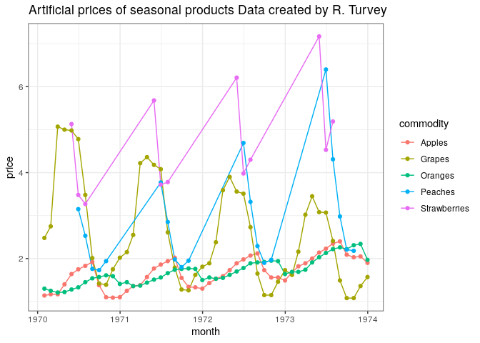
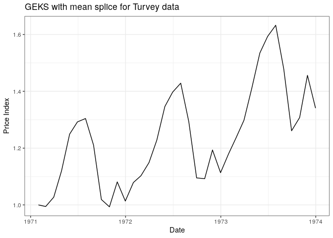
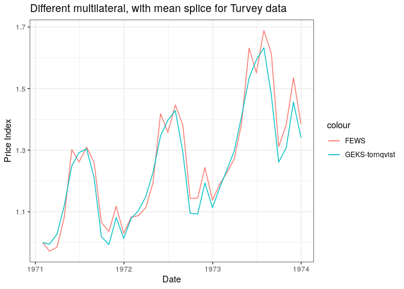
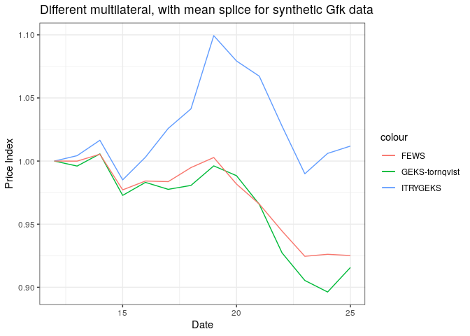

<!-- README.md is generated from README.Rmd. Please edit that file -->
GEKS
====

This package is a modification of the [FEWS
package](https://github.com/MjStansfi/FEWS_package). Where the
individual fixed effects calculation occurs, it has been replaced by a
(modified to include imputed-tornqvist) GEKS calculation from
[IndexNumR: A Package for Index Number
Calculation](https://cran.r-project.org/web/packages/IndexNumR/vignettes/indexnumr.html#the-geks-method).

-   To see the original FEWS package written by Donal Lynch [go
    here](https://github.com/Donal-lynch/FEWS_package)

-   To see the complete IndexNumR package written by Graham White [go
    here](https://github.com/grahamjwhite/IndexNumR)

From the IndexNumR package it uses:

-   GEKS\_w - modified

-   GEKSIndex - modified

-   utils

-   fisher\_t

-   fixed\_t

-   tornqvist\_t

-   ITRYGEKS\_t - newly introduced

Installation
============

GEKS is still in development. For now it can be installed from GitHub
using the following code

``` r

devtools::install_github("MjStansfi/GEKS_package")

#Other suggestions
# devtools::install_github("MjStansfi/FEWS_package")
# devtools::install_github("MjStansfi/TPDdecomp")
#devtools::install_github("grahamjwhite/IndexNumR")

# Once installed, the package can be loaded as usual
library(GEKS)
library(dplyr)
```

Usage
=====

The primary function provided by the GEKS package is the `GEKS()`
function. Running `?GEKS()` should give all the required information on
how using the function. An example of running the `GEKS()` the function
is shown below.

Example
-------

As part of the package, a couple of datasets are provided, including the
Turvery dataset as found in the [Consumer Price Index
Manual](https://www.ilo.org/wcmsp5/groups/public/---dgreports/---stat/documents/presentation/wcms_331153.pdf).

``` r
ggplot(turvey, aes(x = month, y = price)) + 
  geom_line(aes(color = commodity)) + 
  geom_point(aes(color = commodity))+
  theme_bw() +
  ggtitle("Artificial prices of seasonal products Data created by R. Turvey")
```



The GEKS is calculated below with a mean splice and a window length of
13 months.

``` r
turvey_GEKS <- GEKS(times = turvey$month,
                    price = turvey$price,
                    id = turvey$commodity,
                    window_length = 13,
                    weight = turvey$price * turvey$quantity,
                    splice_pos = "mean",
                    index_method = "tornqvist",
                    num_cores = NULL)
```

The resulting index is displayed below

``` r

ggplot(turvey_GEKS$geks, aes(x = price_date, y = fe_indexes)) + 
  geom_line() + 
  theme_bw() +
  ggtitle("GEKS with mean splice for Turvey data")+
  ylab("Price Index") + 
  xlab("Date")
```



We can compare the FEWS and GEKS as follows

``` r
turvey_FEWS <-FEWS(times = turvey$month,
                    logprice = log(turvey$price),
                    id = turvey$commodity,
                    window_length = 13,
                    weight = turvey$price * turvey$quantity,
                    splice_pos = "mean",
                    num_cores = NULL)
```

The resulting index is displayed below

``` r
ggplot(turvey_FEWS$fews, aes(x = price_date, y = fe_indexes, colour = "FEWS")) +
  geom_line() +
  geom_line(aes(x =turvey_GEKS$geks$price_date, y= turvey_GEKS$geks$fe_indexes, colour = "GEKS-tornqvist"))+
  theme_bw() +
  ggtitle("Different multilateral, with mean splice for Turvey data")+
  ylab("Price Index") +
  xlab("Date")
```



Imputation Törnqvist rolling year GEKS (ITRYGEKS)
=================================================

Key functions in this package have been modified to calculate a
Imputation Törnqvist rolling year GEKS (ITRYGEKS) index.

For this to work you need to employ the ‘features’ parameter of the GEKS
function. Below we use this parameter to calculate an index based on
synthetic GfK data.

``` r
str(synthetic_gfk)
#> 'data.frame':    5509 obs. of  15 variables:
#>  $ month_num : int  0 1 2 3 4 5 6 7 8 9 ...
#>  $ char11    : Factor w/ 10 levels "brand_a","brand_b",..: 1 1 1 1 1 1 1 1 1 1 ...
#>  $ char1     : num  10.6 10.6 10.6 10.6 10.6 10.6 10.6 10.6 10.6 10.6 ...
#>  $ char2     : int  16006 16006 16006 16006 16006 16006 16006 16006 16006 16006 ...
#>  $ char3     : Factor w/ 19 levels "val_a","val_b",..: 18 18 18 18 18 18 18 18 18 18 ...
#>  $ char4     : Factor w/ 4 levels "val_a","val_b",..: 1 1 1 1 1 1 1 1 1 1 ...
#>  $ char5     : Factor w/ 5 levels "val_a","val_b",..: 1 1 1 1 1 1 1 1 1 1 ...
#>  $ char6     : Factor w/ 88 levels "FBOK6552","GR3000",..: 49 49 49 49 49 49 49 49 49 49 ...
#>  $ char7     : Factor w/ 3 levels "AAA","BBB","CCC": 3 3 3 3 3 3 3 3 3 3 ...
#>  $ char8     : Factor w/ 2 levels "100M","150D": 2 2 2 2 2 2 2 2 2 2 ...
#>  $ char9     : Factor w/ 4 levels "A100","A450",..: 3 3 3 3 3 3 3 3 3 3 ...
#>  $ char10    : Factor w/ 5 levels "abb","bbb","bhy",..: 5 5 5 5 5 5 5 5 5 5 ...
#>  $ prodid_num: int  3 3 3 3 3 3 3 3 3 3 ...
#>  $ quantity  : int  280 126 148 56 69 43 22 21 9 17 ...
#>  $ value     : int  196420 85312 95920 38552 47397 28303 14812 13701 6304 10651 ...
```

Wrangle this into the necessary format

``` r
library(dplyr)

#Ensure that for each period there is only 1 observation of a given product
#ie sum all quantity and value for given month/product
synthetic_gfk <- synthetic_gfk%>%
  group_by(month_num,prodid_num)%>%
  mutate(quantity = sum(quantity),
         value = sum(value))%>%
  ungroup()%>%
  unique

#Calculate the unit value (price)
synthetic_gfk$uv <- synthetic_gfk$value/synthetic_gfk$quantity

#Extract data.frame containing features of interest
features <-synthetic_gfk[,grepl("char",colnames(synthetic_gfk))]
```

Once the dataframe is in the correct format we can run it through the
main function with index\_method set to ‘impute-tornqvist’.

``` r
ITRYGEKS_index <- GEKS(times = synthetic_gfk$month_num,
                    price = synthetic_gfk$uv,
                    id = synthetic_gfk$prodid_num,
                    features = features,
                    window_length = 13,
                    weight = synthetic_gfk$value,
                    splice_pos = "mean",
                    index_method = "impute-tornqvist",
                    num_cores = NULL)

including_first_window <- c(ITRYGEKS_index$fixed_effects$fe_indexes[1:12], #Take first 12 observations
                            ITRYGEKS_index$geks$fe_indexes*ITRYGEKS_index$fixed_effects$fe_indexes[13]) #Manually splice on at position 13(window length)
```

Lets run a standard tornqvist GEKS and FEWS to compare

``` r
GEKS_index <- GEKS(times = synthetic_gfk$month_num,
                    price = synthetic_gfk$uv,
                    id = synthetic_gfk$prodid_num,
                    features = NULL,
                    window_length = 13,
                    weight = synthetic_gfk$value,
                    splice_pos = "mean",
                    index_method = "tornqvist",
                    num_cores = NULL)

FEWS_index <- FEWS(times = synthetic_gfk$month_num,
                    logprice = log(synthetic_gfk$uv),
                    id = synthetic_gfk$prodid_num,
                    window_length = 13,
                    weight =  synthetic_gfk$value,
                    splice_pos = "mean",
                    num_cores = NULL)
```

``` r
ggplot(ITRYGEKS_index$geks, aes(x =ITRYGEKS_index$geks$price_date, y = ITRYGEKS_index$geks$fe_indexes, colour = "ITRYGEKS")) +
  geom_line() +
  geom_line(aes(x =GEKS_index$geks$price_date, y= GEKS_index$geks$fe_indexes, colour = "GEKS-tornqvist"))+
  geom_line(aes(x =FEWS_index$fews$price_date, y= FEWS_index$fews$fe_indexes, colour = "FEWS"))+
  theme_bw() +
  ggtitle("Different multilateral, with mean splice for synthetic Gfk data")+
  ylab("Price Index") +
  xlab("Date")
```


